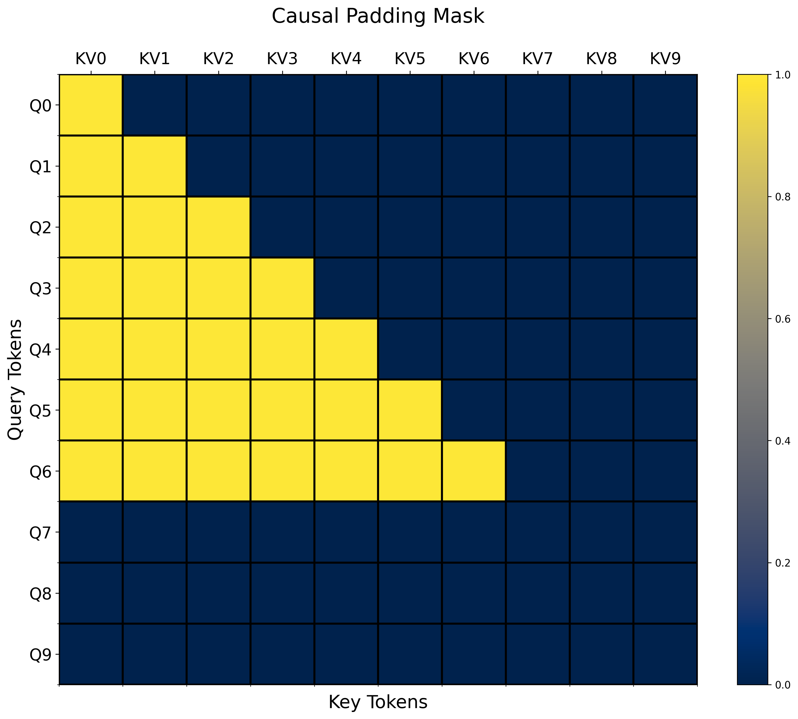

# Casual Attention with Padded Inputs via PyTorch FlexAttention

<div align="center">
    
</div>
<br>
This small script covers how to handle both causal attention and padded inputs with the new FlexAttention and BlockMask features of torch >= 2.5.
<br>
<br>
I was unable to find any clear code or discussions online covering padded input sequences and FlexAttention, so I thought I'd describe one way of implementing it along with causal attention. 
<br>
<br>

#### Install:
```sh
git clone https://github.com/pytorch-labs/attention-gym.git
cd attention-gym
pip install .
cd ../
```
Here we install via the <a href="https://github.com/pytorch-labs/attention-gym">attention-gym git-hub</a> as it will ensure compatibility and give us access to their visualization tool. In general, just make sure your torch version is >= 2.5 and you have a CUDA compatible GPU.  

#### Run [<u>causal_padded_flexattn.py</u>](./causal_padded_flexattn.py)

```sh
python causal_padded_flexattn.py
```


### Causal and Padding mask_mod functions:

```python
def causal(b, h, q_idx, kv_idx):
    return q_idx >= kv_idx

def create_padding_mask(pads):
    def padding(b, h, q_idx, kv_idx):
        return ~pads[b, q_idx] & ~pads[b, kv_idx]
    return padding
```

Here `pads` is a BoolTensor of size `(batch_size, max_seq_len) `where positions of padding tokens are True and the other token positions are False. The `padding` mask_mod function returns a padding mask where attention scores will only be calculated when neither the query nor key/value token are padding.

### For a full breakdown of [<u>causal_padded_flexattn.py</u>](./causal_padded_flexattn.py) checkout my [blog](https://medium.com/@lucasmgomez/casual-attention-with-padded-inputs-via-pytorch-flexattention-25e21b294551)!


#### Resources used:
- https://pytorch.org/blog/flexattention/ 
- [https://github.com/rasbt/LLMs-from-scratch/tree/main/ch03/02_bonus_efficient-multihead-attention](https://github.com/rasbt/LLMs-from-scratch/tree/main/ch03/02_bonus_efficient-multihead-attention)
- https://github.com/ViktorooReps/llm-experiments/blob/59fe19a6fe6be2cd3652f75afcc90156953889cc/src/models/modelling_llama_long_context.py#L226
- https://github.com/pytorch-labs/attention-gym/issues/38
